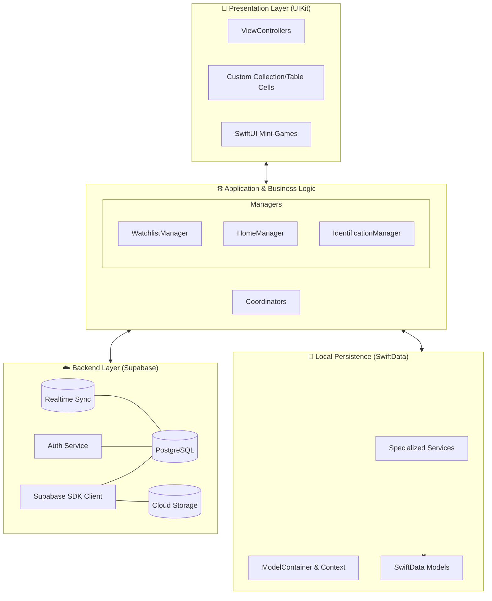

# 🏗️ SkyTrails System Architecture

SkyTrails is built on a modern, decoupled architecture designed for scalability, performance, and a seamless native user experience. The system follows a **Clean MVC** pattern enhanced with a **Service-Oriented** persistence layer and a robust **Supabase** backend for cloud synchronization.

---

## 🗺️ High-Level Architecture

The following diagram illustrates the flow of data and responsibility across the different layers of the application.

---

## 🧩 Architectural Components

### 1. Presentation Layer (UI)
*   **UIKit & Storyboards:** Primary framework for navigation and complex layouts.
*   **Compositional Layouts:** Used for highly dynamic and responsive collection views on the Home and Watchlist screens.
*   **SwiftUI Integration:** Leveraged for interactive elements like the Migration Mini-Game via `UIHostingController`.

### 2. Application Layer
*   **Managers (Singletons):** Central hubs for domain-specific logic (Home, Watchlist, Identification). They coordinate between the UI and various data services.
*   **Coordinators:** Manage complex navigation flows to keep ViewControllers lean and focused on UI logic.

### 3. Local Persistence Layer
*   **SwiftData:** The core engine for native object persistence, replacing traditional Core Data with a more modern, Swift-native approach.
*   **Service-Oriented Architecture:** Specialized services (e.g., `WatchlistPersistenceService`, `WatchlistRuleService`) handle isolated tasks, ensuring high maintainability and testability.

### 4. Backend & Cloud Layer
*   **Supabase:** Provides a robust backend-as-a-service (BaaS) infrastructure.
*   **PostgreSQL:** Handles relational data storage with PostGIS support for geospatial queries.
*   **Realtime:** Enables live synchronization of shared watchlists and community observations across multiple devices.
